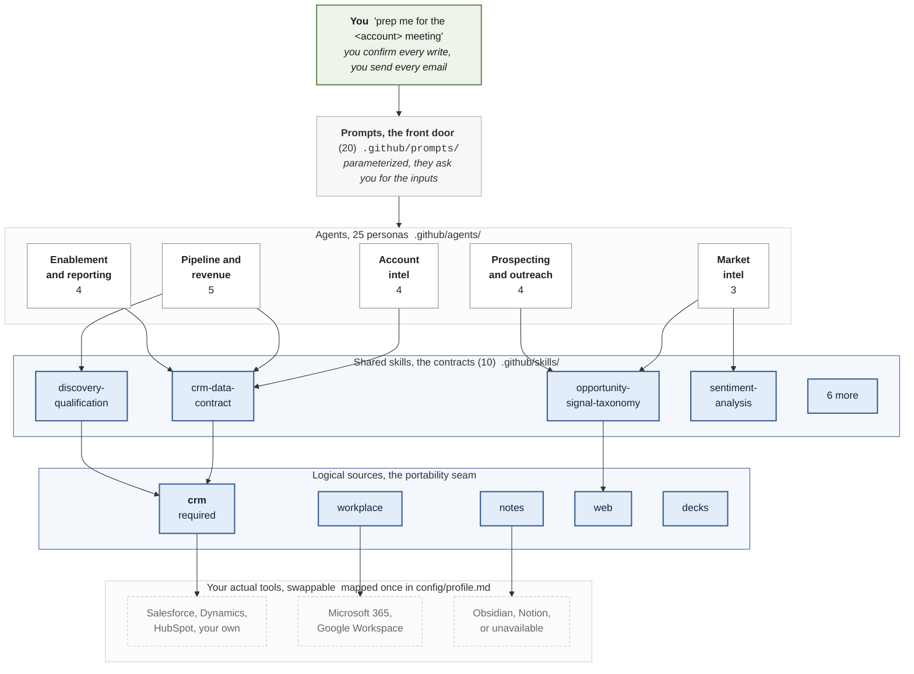
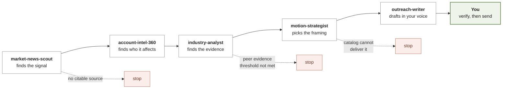

# sales-agent-foundation

A working foundation for building **a team of AI agents that help you do a
revenue job**, not a demo of one clever agent.

It ships no application code, no credentials, and no data. It ships the durable
part: twenty-five agent definitions, their reusable prompts, ten shared skills,
the project rules that keep them honest, and a validator that fails the build if
any of it drifts.

Clone it, fill in one profile file, and you have agents that use *your* CRM,
*your* book, and *your* voice.

[](https://github.com/alipouw13/sales-agent-foundation/actions/workflows/validate.yml)

---

## Why this exists

Most agent examples show one agent doing one impressive thing. Real work is not
one thing. A seller's week is a dozen recurring workflows that feed each other:
research an account, inspect a deal, clean the pipeline, find the gap to target,
build the message, write the deck, report the week.

Those workflows only compound if the agents agree with each other. If your
research agent scores sentiment one way and your news agent scores it another,
you cannot compare their output. If one agent invents a plausible number, every
downstream agent inherits it.

So this repo is opinionated about three things:

1. **Shared contracts, not shared prose.** Anything two agents both need (a
   qualification rubric, a signal vocabulary, a tone scale, a CRM field map)
   lives in a *skill* they both read. Their output stays comparable.
2. **Guardrails that are checked, not just written down.** No fabrication, cite
   per claim, drafts only, propose never write, sensitive output stays local.
   `tools/validate_repo.py` fails the build on the mechanically checkable ones.
3. **Portable by construction.** No agent names a vendor tool. They name logical
   sources (`crm`, `workplace`, `notes`, `web`, `decks`) that you map to
   whatever you actually have. The same agents work on Salesforce, Dynamics, or
   HubSpot.

## What is in the box

| | |
| --- | --- |
| **25 agents** | 5 lifecycle personas plus 20 revenue workflows, in [`.github/agents/`](.github/agents/) |
| **20 prompts** | One reusable, parameterized prompt per revenue workflow, in [`.github/prompts/`](.github/prompts/) |
| **10 skills** | The shared rubrics, taxonomies, and contracts, in [`.github/skills/`](.github/skills/) |
| **6 role playbooks** | Adoption paths by what you are measured on, in [`docs/roles/`](docs/roles/) |
| **1 worked example** | An end-to-end agent chain, placeholders only, in [`examples/worked-chain.md`](examples/worked-chain.md) |
| **1 validator** | [`tools/validate_repo.py`](tools/validate_repo.py), Python standard library only, no dependencies |

Browse the full list in [**the agent catalog**](.github/AGENT-CATALOG.md).

The agent team, by group:

- **Account intelligence.** `account-brief`, `account-intel-360`,
  `industry-analyst`, `market-news-scout`. Who the account is, who to talk to,
  and why now.
- **Market intelligence.** `market-intel-sweep`, `filing-analyst`,
  `earnings-call-analyst`. What the account is telling the market, from public
  disclosure only.
- **Pipeline and revenue.** `pipeline-hygiene`, `gap-analysis`, `deal-review`,
  `forecast-review`, `renewal-expansion`. Keeping the number honest.
- **Prospecting and outreach.** `prospecting-sequence`,
  `outreach-orchestrator`, `motion-strategist`, `outreach-writer`. Turning a
  signal into a message a human sends.
- **Enablement and reporting.** `enablement-deck`, `deck-editor`,
  `weekly-impact`, `portfolio-dashboard`. Communicating the work.
- **Lifecycle.** `spec`, `plan`, `build`, `validate`, `code-reviewer`. How
  changes to this repo get made.

## How it fits together

Six layers. The two in the middle are what make the whole thing work.



Read the two highlighted layers first, because they are the whole design:

**Shared skills are contracts, not documentation.** Notice that agents from
different groups point at the *same* skill. That is deliberate. If the filings
agent scored management tone one way and the news agent scored it another, you
could not compare them, and a ranked list built from both would be meaningless.
So the tone rubric lives in one place that both read. Same for the qualification
rubric, the signal vocabulary, and the CRM field map.

This is also the highest-leverage place to customize. Editing
`discovery-qualification` to match how your company actually qualifies deals
updates `deal-review`, `gap-analysis`, `pipeline-hygiene`, and `forecast-review`
at once, and they stay consistent with each other.

**Logical sources are the portability seam.** No agent ever names a vendor
product. They ask for `crm`, `workplace`, `notes`, `web`, or `decks`, and you map
those once in a gitignored profile. That is why the same agents work on
Salesforce and on Dynamics. It is also why a partial setup still works: anything
you map to `unavailable` gets reported as missing rather than quietly invented
around. Only `crm` is load-bearing, because without it everything downstream
would be fabrication.

Running down the right-hand side of all of this, every agent inherits the same
guardrails: no fabrication, cite per claim, propose never silently write, drafts
only, output stays local, and always report a `Gaps` line. See
[Safety and data handling](#safety-and-data-handling).

### The value is in the handoffs

A single agent is mediocre. Chained, each one narrows the next one's job, and
every narrowing is grounded in a source:



Three of those five steps can refuse to continue. That is the point. An agent
team that cannot say "there is no credible reason to reach out here" is not a
productivity tool, it is a way to send more bad email faster.

Walked through end to end in
[`examples/worked-chain.md`](examples/worked-chain.md).

## What a run actually looks like

Shape matters more than the words. Here is a trimmed `account-brief` output, with
placeholders standing in for real data:

```text
Resolved: <account name> (parent entity), 4 open opportunities,
3 people on the internal team. Sources answered: crm, web.
notes unavailable, workplace unavailable.

HISTORY AND CONTEXT
  No meeting or mail history available. This brief is CRM and
  public sources only.

OPEN OPPORTUNITIES                                     [source: crm]
  <opp name>   Stage 3   <amount> <ccy>   closes <date>
      last activity 47 days ago  -> STALE, past the stage threshold
  <opp name>   Stage 1   <amount> <ccy>   closes <date>
      close date has passed  -> needs a decision

WHITESPACE                             [catalog vs. current footprint]
  Gap: <catalog item>
      Evidence: <company> 10-K filed <date>, Item 1A, "<verbatim
      excerpt>" https://www.sec.gov/...
  Gap: <catalog item>
      No supporting evidence found. Not raised.

STAKEHOLDERS                                    [source: crm + web]
  <role>, VP-level, inferred economic buyer, confidence MEDIUM
      basis: title plus signing authority on prior record
      last contact 112 days ago  -> COLD
  COVERAGE GAP: no executive contact inside the freshness window.

NEXT STEP
  One sentence, one action, doable today.

GAPS
  workplace unmapped, so no relationship history or recency.
  notes unmapped, so no prior thinking is reflected.
  2 of 4 opportunities have no identified economic buyer.
```

Four things to notice, because they are the whole design:

1. **It says what it could not do.** "No meeting or mail history available" is
   the correct output when a source is unmapped. The alternative is an agent
   that writes smooth prose over a hole.
2. **Every claim carries its source.** The whitespace recommendation cites a
   filing with a date and a verbatim excerpt, so you can check it in thirty
   seconds. The second gap had no evidence, so it was not raised at all.
3. **Confidence is explicit.** "Inferred economic buyer, confidence MEDIUM,
   basis: ..." lets you decide how much weight to put on it.
4. **The `Gaps` block is often the most useful part.** It is your data telling
   you where it is thin. Two opportunities with no economic buyer is a finding.

## What this is not

Worth being clear, so you can decide fast whether to keep reading:

- **Not a product or a service.** There is nothing to deploy, nothing to run,
  and nothing to pay for. It is markdown that your assistant reads.
- **Not an autonomous system.** Nothing sends an email. Nothing writes to your
  CRM without showing you the change first. If you want auto-send, this is the
  wrong starting point, deliberately.
- **Not a prompt pack.** The prompts are the smallest part. The contracts in
  `.github/skills/` are what make the output consistent enough to rely on.
- **Not a replacement for knowing your accounts.** It compresses research and
  drafting. It does not have judgment, and it will confidently hand you a
  well-sourced brief about the wrong priority.
- **Not finished.** It is a foundation that expects to be edited. If you use it
  unchanged for six months, you are probably not getting much from it.

## Prerequisites

| Requirement | Why | Verify with |
| --- | --- | --- |
| An agentic coding assistant that reads `.github/agents/` and `.github/prompts/` | It is what runs these personas. GitHub Copilot CLI, Copilot in VS Code, Claude Code, or any host with the same convention | Open this repo in it and ask "which agents do you see" |
| A **CRM** your assistant can query, usually via an MCP server | The only genuinely required data source. Everything about your book comes from here | Ask "who am I in the CRM" |
| Python 3.9 or newer | Only to run the validator. Nothing else uses it. No packages to install | `python --version` |
| Git | To clone, and to keep your fork's guardrails in place | `git --version` |

Optional, and each one unlocks more:

| Optional | Unlocks |
| --- | --- |
| A **workplace data** source (mail, calendar, chat) | Meeting and mail history in briefs, weekly roll-ups, and voice derivation for outreach |
| A **notes** source (Obsidian, Notion, a markdown folder) | Your own prior thinking in briefs and account history |
| **Web search and fetch** | Filings, transcripts, news, the whole market intelligence group |
| A **presentation** skill | `enablement-deck` and `deck-editor` |

There is nothing to install and nothing to authenticate. These agents ask tools
your assistant already has. If a workflow seems to need a new credential, the
answer is to find the tool that already covers it, not to add auth here.

## Quickstart

```bash
git clone https://github.com/alipouw13/sales-agent-foundation.git
cd sales-agent-foundation
cp config/profile.example.md config/profile.md   # Windows: copy
python tools/validate_repo.py                    # should print "All checks passed."
```

Then, in your assistant, from this folder:

1. **Map your sources.** Ask "list the tools you have available", then fill in
   the `sources:` block in `config/profile.md`. See
   [`docs/data-sources.md`](docs/data-sources.md).
2. **Fill in the rest of the profile.** Role, segment, book shape, target bucket
   names, and your solution catalog. Names only, never numbers. Fifteen minutes.
3. **Pick your role playbook.** [`docs/roles/`](docs/roles/) tells you which
   three agents to start with and why.
4. **Run the first one.** Open the matching prompt from `.github/prompts/` and
   run it. It will ask you for the inputs.

Full walkthrough: [`docs/getting-started.md`](docs/getting-started.md).

## How to tailor it to your job

This repo is a starting point that expects to be edited. The four levels of
customization, cheapest first:

| Level | What you change | When |
| --- | --- | --- |
| **1. Profile** | `config/profile.md` only | Always. This is the thirty minute step that makes everything else yours |
| **2. Skills** | The rubrics in `.github/skills/` | Your company already has a qualification method, a stage model, or a signal vocabulary. Edit the skill, and every agent that reads it changes at once |
| **3. Agents** | Individual `.github/agents/*.agent.md` | A workflow in your role works differently. Edit the process steps, keep the guardrails |
| **4. New agents** | Add an agent, a prompt, and a catalog row | You have a recurring workflow nobody here covers |

The highest-leverage edit is **level 2**. Changing the
`discovery-qualification` skill to match your company's actual method updates
`deal-review`, `gap-analysis`, `pipeline-hygiene`, and `forecast-review`
simultaneously, and they stay consistent with each other.

Full guide: [`docs/customize.md`](docs/customize.md). Adding an agent:
[`docs/authoring-agents.md`](docs/authoring-agents.md).

## How to get the most out of it

- **Chain agents, do not stack prompts.** The value is in the handoffs.
  `market-news-scout` finds a signal, `account-intel-360` finds who it affects,
  `motion-strategist` picks the framing, `outreach-writer` drafts it. Each one
  is mediocre alone and good in sequence. See
  [`examples/worked-chain.md`](examples/worked-chain.md) for that chain walked
  end to end, including where each agent is allowed to stop it.
- **Run the recurring ones on a rhythm.** Every role playbook has a cadence
  table. Weekly hygiene and a Friday roll-up beat an occasional brilliant run.
- **Read the `Gaps` line.** Every agent reports what it could not resolve. That
  line is usually more useful than the output, because it tells you where your
  data is thin.
- **Fix the source mapping before you blame the agent.** Most disappointing
  first runs are an unmapped source, not a bad prompt.
- **Keep the guardrails.** They are not decoration. "Propose, never write" is
  what makes it safe to point `pipeline-hygiene` at a live CRM.
- **Check the citations.** Every external claim carries a URL and a date so you
  can verify it in thirty seconds. Do that, especially early.

## Safety and data handling

The repo is safe to open source. What you *generate* with it is not.

- Agent output blends your employer's customer data with your own numbers. It
  goes to `output_dir`, which is gitignored, and never gets committed.
- `config/profile.md` is gitignored. Keep it that way.
- Outreach agents produce drafts. They never send, and never mark a contact as
  touched. Sending stays a human action in your own client.
- CRM writes are staged for confirmation. Nothing is applied silently.
- The validator fails the build on any email address outside a placeholder
  domain, any bare GUID, and anything that looks like a credential.

Read [`SECURITY.md`](SECURITY.md) before you point an agent at production
systems, and check your employer's policy on automated access to CRM and
workplace data.

## Contributing

Read [`CONTRIBUTING.md`](CONTRIBUTING.md) and
[`.github/copilot-instructions.md`](.github/copilot-instructions.md). The short
version: spec, plan, build, validate, review, ship. Run
`python tools/validate_repo.py` before every commit. Never commit customer data,
credentials, real names, or real numbers.

The contracts every file must satisfy are in [`SPEC.md`](SPEC.md).

## License

[MIT](LICENSE). Use it, fork it, make it yours.
